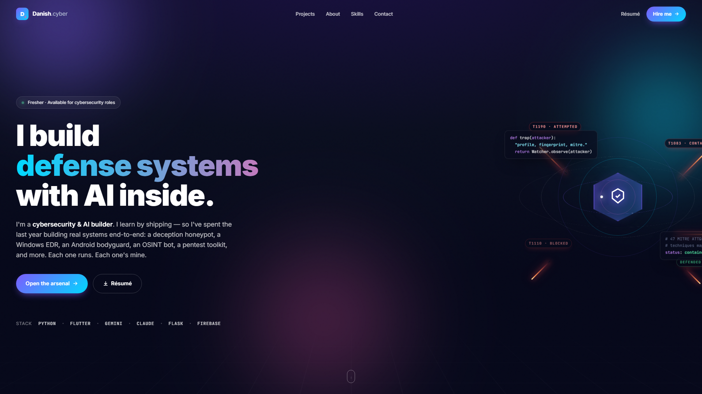

<div align="center">

# 🎬 Danish — Portfolio Site

### Cinematic personal showcase — 10 projects, 10 bespoke entrance animations


</div>

---

## What this is

A personal portfolio website built like a **cinematic showcase**, not a CV. Opens with a *Meet Danish* dossier intro and a cyber-warfare hero scene, then dissolves into 10 project scenes — each with its own bespoke entrance animation:

> MIRAX · HEIMDALL + AEGIS · GUARD · AURA · SPIDY · CORIZO · COLDBOX · CyberMentor · Neural Lock · L&T × Sony

Recruiters skim portfolios in 30 seconds. A cinematic, interactive site makes them **stop and watch** — turning a "meh" click into a memorable impression and a callback.

## Demo

(Video URL inserted after drag-drop upload.)



## Run locally

```bash
git clone https://github.com/Danish-spidy/danish-portfolio
cd danish-portfolio
python -m http.server 8181
# open http://localhost:8181 in Chrome
```

## Stack

- **HTML + CSS + JavaScript** — no framework, max speed
- **GSAP** for animation orchestration
- **Custom motion logic** for each project scene

Hosts free on GitHub Pages once deployed to a custom domain.

## Licence

(c) 2026 Danish · All rights reserved.
